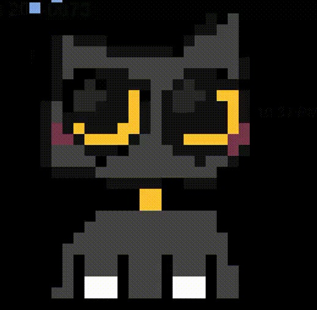

<h3 align="center">ML & Robotics Software Engineer | Master's in Robotics @ ASU | Perception, ML, Navigation, Manipulation</h3>

  I'm deeply invested in the intersection of Robotics and AI. I enjoy coding and 
  exploring the rapidly growing world of Robotics and ML. Apart from programming, 
  I like building robots and testing out microcontrollers and sensors.

  &nbsp;
  &nbsp;
  

---

### 🛠️ Tech Stack

  &nbsp;
  &nbsp;
  &nbsp;
  &nbsp;
  &nbsp;
  &nbsp;
  &nbsp;
  
   
  &nbsp;
  &nbsp;
  

 

---

<h3 align="center">📊 GitHub Stats</h3>

  
  

  <strong>Check out my pinned repositories below to see my work!</strong>

